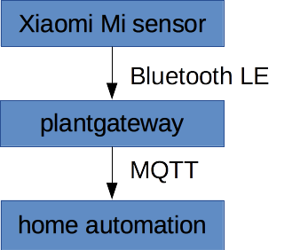
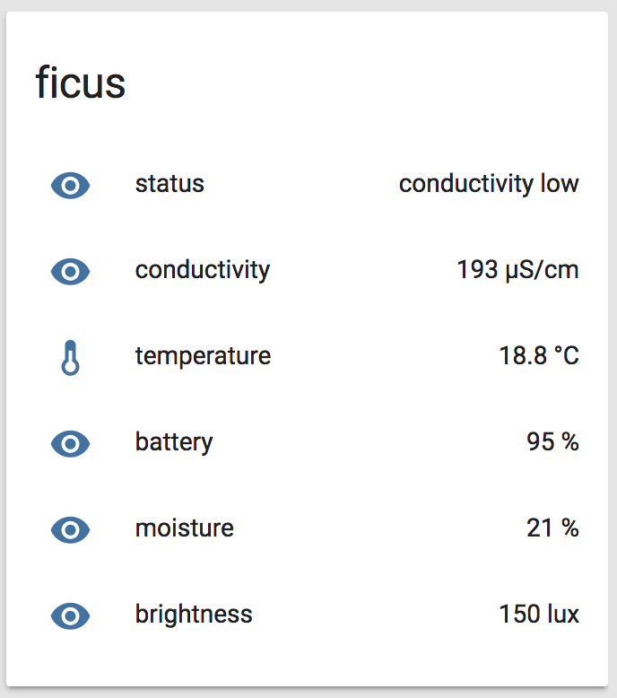

# Goal

* Get an email when my plants need water and/or fertilizer.
* Make my plants happy.
* Collect some data for the sake of data colleciton.

# Architecture

The basic idea for the plantgateway is to read the sensor data from the Xiaomi Mi plant sensors via Bluetooth LE and send it via MQTT to the home automation server.



This should help to word around the limited range of Bluetooth LE. It will also allow to collect the sensor data from different location in one single home automation system.

# Hardware
Here's the list of hardware components I'm using.

## Sensors

I'm using the [Xiaomi Mi plant sensors](http://www.gearbest.com/other-garden-supplies/pp_373947.html). The cost about 12 EUR when ordering from China.

Note: If you order it from China, you might have to pay for import tax.


Features:

* Bluetooth LE interface
* integrated coin cell battery, should last a year
* It can measure these values
   * moisture in %
   * conductivity in us/cm (which is somehow related to fertilizer) 
   * temperature in °C
   * brightness in lux
* security 
	* None. 
	* Seariously, none. 
	* Really anyone in range can read the sensors. 


## Bluetooth LE adapter

For the machines that do not have an integrated Bluetooth LE adapter, I'm using a [LogiLink BT0015 USB bluetooth V4.0 EDR Class1 Micro](https://www.amazon.de/gp/product/B0096Y2HFW/ref=ox_sc_act_title_2?ie=UTF8&psc=1&smid=A3JWKAKR8XB7XF
Gateway). But basically any Bluetooth LE adapter that is supported by the linux kernel should do.

## Gateway

Since the range of Bluetooth LE is quite limited. In my apartment the range is about 5 meters and might go through one wall if I'm lucky. So I need some gateway near the sensors.

In my current solution I'm using a Rasberry Pi to read the sensor data via Bluetooth LE.

In my planned solution I want to use a [C.H.I.P](https://getchip.com/pages/chip) to do the same thing in a smaller and cheaper way.

* ARM chip, runs Linux
* Has WiFi and Bluetooth LE integrated
* Costs only 9 $
* But these devices out of stock at the moment, so I'll have to wait

## Home Automation server

Use whatever you want, I have a [Turris Omnia](https://omnia.turris.cz/en/) router running [OpenWRT](https://openwrt.org/).

# Software

And this is the software setup for the hardeware mentioned above.

## plantgateway

The [plantgateway](https://github.com/ChristianKuehnel/plantgateway) (this project) reads the sensor data via Bluetooth LE and sends it via MQTT to the home automation server.


## Home Automation solution

I'm running [Home Assistant](https://home-assistant.io/) on [Alpine Linux](https://alpinelinux.org/) inside a LXC container. Alpine Linux has a very small footprint and is well suited to be used in containers.

About Home Assistant:

* Like:
   * Python based
   * Many plugins available
   * Easier to set up and maintain than FHEM (what I used before)
   * does what it's supposed to do
* Dislike:
   * no real complaints so far...

I'm working on the [migardener](https://github.com/ChristianKuehnel/home-assistant/blob/dev/homeassistant/components/sensor/migardener.py), a component for Home Assistant to provide a nice interface and also check how the plant is doing. But that's still work in progress:



If you just want to install that one component you can put this in a script and run it when you want to install/update the compoent:
```
#!/bin/sh
cd ~homeassistant/.homeassistant/custom_components/sensor
curl -O https://raw.githubusercontent.com/ChristianKuehnel/home-assistant/dev/homeassistant/components/sensor/migardener.py
```

## MQTT server

I'm using [mosquitto](https://mosquitto.org/), again running on Alpine Linux inside a LXC container)

Security:

* available as package in Alpine Linux
* authentication via username and password
* TLS encryption, based on certificates from [Let's Encrypt](https://letsencrypt.org/)
	* The ACME client is also available as [package](https://pkgs.alpinelinux.org/package/v3.3/community/x86/letsencrypt) on Alpine Linux and works out of the box
* remark: some MQTT clients (e.g. from FHEM) do not support client certificates, but all do support TLS and username/password

If you are running MQTT for critical applications, you might want to [monitor the MQTT server from Nagios/Icinga2](https://github.com/jpmens/check-mqtt).


# Devleopment tools / libraries

To help with the devleopment I can recommend these tools:

## Debugging MQTT

To debug mqtt related things, I'm using [MQTT.fx](http://mqttfx.jfx4ee.org/). This tool allows you to send and receive messages via MQTT. It helps to figure out, if you really did what you wanted to do.

## reverse engineering the bluetooth communication

You can reverse engieer the protocol by just watching the Xiaomi Plant app:

1. Enable the Bluetooth HCI logging on your phone (On your Android phone go to settings -> developer options -> enable bluetooth HCI logging)
1. Install and run the [Flower care App](https://play.google.com/store/apps/details?id=com.huahuacaocao.flowercare) and perform the operations you want to reverse engineer.
1. Download the /sdcard/hci.log file from the phone to a PC
1. Open the log file in [Wireshark](https://www.wireshark.org/) and guess what's going on
1. Implement the operations yourself to see if you got the right commands
1. Then implement a nice API around that for everyone to use and publish it :)

A lot of valueable information about the sensor and the protocol can be found here in this [blog post](https://www.open-homeautomation.com/de/2016/08/23/reverse-engineering-the-mi-plant-sensor/).

## bluepy

For the communication via Bluetooth LE I'm using [bluepy](https://github.com/IanHarvey/bluepy). It offers access to the GATT protocol in a straight forward way. This is much more convenient than writing a command line wrapper for the linux command gatttool.

## paho-mqtt

For the communication with the MQTT server there is also a very convenient library for python: [paho-mqtt](https://eclipse.org/paho/clients/python/docs/) It also offers a very easy solution for publishing data.
